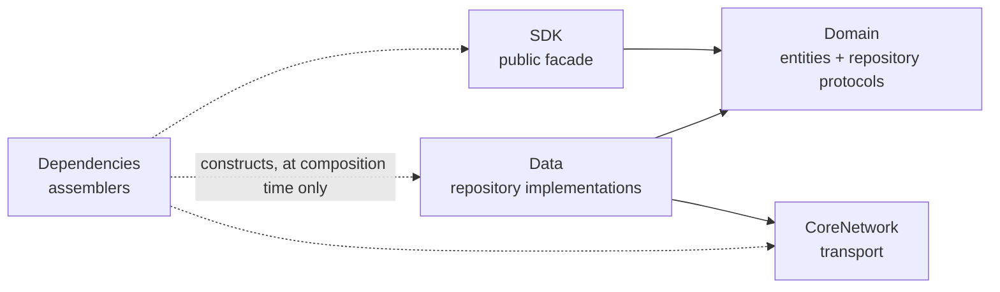
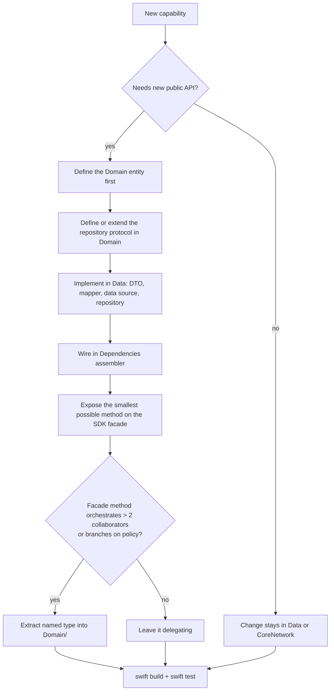

# Architecture

ContentSyncKit is a distributable Swift package, not an application. That single fact
drives every rule below: the public API surface is the product, and everything else is
an implementation detail that must stay replaceable.

## Baseline

- Platform: iOS 15+, built with the Swift 6.2 toolchain, strict concurrency.
- Distribution: Swift Package Manager, source. No third-party dependencies in the package target.
- Layer chain: `SDK -> Domain <- Data -> CoreNetwork`
- Package code goes under `Sources/ContentSyncKit/`.
- Consumer-facing demo code goes under `Example/ContentKitExample/` and is never imported by the package.

## The dependency rule

One rule governs the whole package: **source dependencies point inward.** An inner layer
never imports an outer one.



`Domain` is the centre and depends on nothing — not Foundation networking, not persistence,
not the SDK layer above it. `Data` depends on `Domain` because it *implements* Domain's
protocols; the arrow points inward even though data flows outward at runtime. That inversion
is the whole point.

`Dependencies` is the composition root. It is the one place allowed to know every layer,
because construction is not a dependency in the architectural sense — nothing calls back into it.

## Folder structure

```text
Sources/ContentSyncKit/
  SDK/
    ContentSyncClient.swift         public facade — the entire public API
    ContentSyncClient+Configuration.swift   nested Configuration and Error
  Domain/
    Entity/
      ContentItem.swift
      ContentBundle.swift
      Manifest.swift
      SyncPolicy.swift
      SyncError.swift
    Repositories/
      ContentRepository.swift       protocol only
      ManifestRepository.swift      protocol only
  Data/
    DTO/
      ContentItemDTO.swift
      ManifestDTO.swift
    Mapping/
      ContentItemMapper.swift
    DataSources/
      Remote/
        RemoteContentDataSource.swift
      Local/
        LocalContentDataSource.swift
    Repositories/
      DefaultContentRepository.swift
      DefaultManifestRepository.swift
    Storage/
      Database/
      File/
    Cache/
      ContentCache.swift            actor
  CoreNetwork/
    NetworkClient.swift
    Middleware/
    Model/
  Dependencies/
    ModuleAssembler.swift
    ContentAssembler.swift
    NetworkAssembler.swift
  Shared/
  Extensions/
```

Structure is by layer, not by feature. A package this size has one feature — synchronising
content — so feature-module partitioning would produce a single module and add nothing.

## Layer responsibilities

| Layer | Owns | Must not |
|---|---|---|
| `SDK` | The public API surface, configuration, lifecycle. Delegates to repositories. | Hold business rules, touch DTOs, know about `CoreNetwork` or storage |
| `Domain` | Entities and repository protocols. Pure Swift. | Import Foundation networking, persistence, or anything from `Data`/`SDK`/`CoreNetwork` |
| `Data` | Repository implementations, DTOs, mapping, data sources, caching, storage. | Expose DTOs upward, contain public API decisions |
| `CoreNetwork` | HTTP transport, middleware chain, retry and auth plumbing. | Contain business rules or know what content *means* |
| `Dependencies` | Constructing the object graph and injecting it. | Contain logic beyond wiring |
| `Shared` | Genuinely cross-layer utilities. | Become a dumping ground — see the rule below |

`Shared` earns an entry only when the same type is needed by two layers that must not
depend on each other. If only one layer uses it, it belongs in that layer.

## Public surface rules

The public surface is the one thing consumers depend on and the one thing you cannot
quietly change. Treat it as the scarcest resource in the package.

- `public` appears only in `SDK/`, and on the `Domain` entities the API actually exposes.
- Everything else is `internal`. When a type needs to cross a module boundary for tests, use
  `@testable import`, not `public`.
- Repository protocols are `internal`. Consumers get the facade, not the seams.
- Adding a `public` symbol is a deliberate act reviewed on its own merits. Removing one is a
  breaking change for every consumer, so it gets a `!` commit per `COMMIT_CONVENTIONS.md`.

## Concurrency model

Swift 6.2 strict concurrency is the reason this package is not a direct port of anything older.

- All `Domain` entities are `Sendable` value types. No reference-type entities.
- Mutable state lives in an `actor` — `ContentCache`, the facade itself. Never a class guarded by locks.
- All repository and data-source protocols are `Sendable` and use `async throws`. No completion
  handlers, no Combine publishers.
- `@unchecked Sendable` requires a written justification in a comment naming the invariant that
  makes it safe. Absent that, it does not merge.
- Cancellation propagates through `try await`. Use `async let` for independent concurrent fetches;
  call `Task.checkCancellation()` before expensive work such as writing a bundle to disk.

## The DTO boundary

DTOs are transport shapes. Entities are domain concepts. They are never the same type, even
when their fields match today.

- `Codable` conformance lives on DTOs in `Data/DTO/`, never on `Domain` entities.
- Mapping happens in `Data/Mapping/`, in pure functions with no side effects.
- Mapping failure is a domain error (`SyncError.malformedContent`), not a decoding error escaping upward.
- A DTO appearing in a `Domain` or `SDK` signature is an architecture bug, not a style preference.

## No UseCase layer

This package deliberately has no `Domain/UseCases/`. The dependency rule is unaffected — that
rule is about direction, not layer count — but the omission is intentional and bounded by a
threshold.

**Why:** for an SDK, the facade methods *are* the use cases. There is one consumer path, so a
type-per-operation produces passthrough shells whose `execute()` forwards a single repository
call. Such a layer looks architectural while carrying no policy, and its tests assert only that
a mock was called.

**The threshold that keeps this honest:**

> Facade methods delegate. A method that orchestrates more than two collaborators, or branches
> on policy, moves into a named type in `Domain/` — `SyncCoordinator`, `ContentResolver`.

Name the extracted type after the operation it performs, not after the pattern. Extract when the
threshold is crossed; do not create one per public method by default. When conflict resolution,
scheduling, or multi-source reconciliation arrives, that is the trigger.

## Dependency injection

Assemblers, not a container and not singletons.

- Dependencies are constructed in `Dependencies/` and injected through initializers.
- Every type stores its collaborators privately and never reaches for a global.
- The public facade may expose a convenience shared instance, but it must be built on the same
  injectable initializer the tests use. A dependency reachable only through a singleton is
  untestable by construction.

## Adding a capability



Define the interface before the implementation. The repository protocol is the contract; writing
it first forces the boundary to be designed rather than discovered.

## Anti-patterns

| Smell | Correct |
|---|---|
| `SDK/` imports `CoreNetwork` or a concrete repository | Depend on the `Domain` repository protocol; let the assembler supply the implementation |
| A `Domain` entity conforms to `Codable` | Add a DTO in `Data/DTO/` and map at the boundary |
| Business rules inside `DefaultContentRepository` | Repositories fetch and map. Policy belongs in the facade, or an extracted `Domain` type past the threshold |
| A `public` symbol outside `SDK/` | Make it `internal`; use `@testable import` for tests |
| `class` plus `NSLock` for shared mutable state | `actor` |
| Unit test that needs a network or a real file system | Inject a stub conforming to the repository or data-source protocol |
| Utility parked in `Shared/` used by one layer | Move it into that layer |

## Verification

No change to this package is complete without:

- `swift build` and `swift test` — the package.
- `xcodebuild -project Example/ContentKitExample.xcodeproj -scheme ContentKitExample -destination 'platform=iOS Simulator,name=iPhone 17' build test` — the consumer.

The Example app is the only place the package is consumed the way a real client consumes it. If
a change compiles in the package but breaks the Example, the public API changed and the change is
incomplete.
