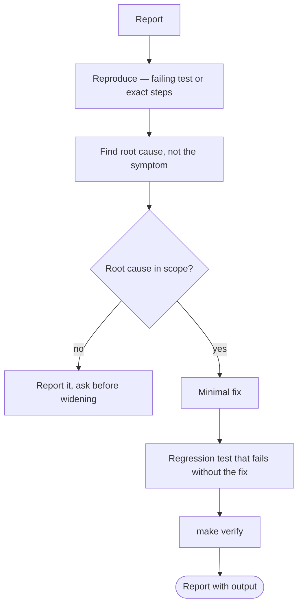

# Workflows — Classify Before Coding

Read this first. Pick exactly one class, then follow its row.

| Class | Trigger | Allowed scope | Required output |
|---|---|---|---|
| Investigation only | "why", "where", "how does", "is it possible" | Read + search. **No mutation.** | Findings with `file:line` refs |
| Bug fix | Defect in existing behavior | Smallest compatible change at the true root cause | Fix + regression test + `make test` output |
| New feature | New capability | New unit under `Sources/ContentSyncKit` | Feature + tests + how it was verified |
| Refactor | Explicit restructure request | Behavior-preserving only | Green tests before and after |
| Test only | Coverage gap | Test files only | New tests + run output |
| Maintenance | Deps, config, tooling | Named files only | What changed and why |

## Rules that apply to every class

1. **Read before write.** Open the nearest sibling implementation and match it.
2. **No opportunistic refactors.** Unrelated cleanup needs its own request.
3. **No new abstraction layers** unless the user asks by name.
4. **Verify before claiming.** No "fixed" / "works" / "passing" without `make verify` output in the transcript.
5. **Ambiguity:** do everything that does not depend on the answer, then ask one specific question.

## Bug fix flow

## Escalate to the user when

- The fix requires changing a public interface used by other modules.
- The correct behavior is genuinely ambiguous in the spec.
- A migration or destructive operation is implied.
- The task needs a value from {{SECRET_PATHS}}.
